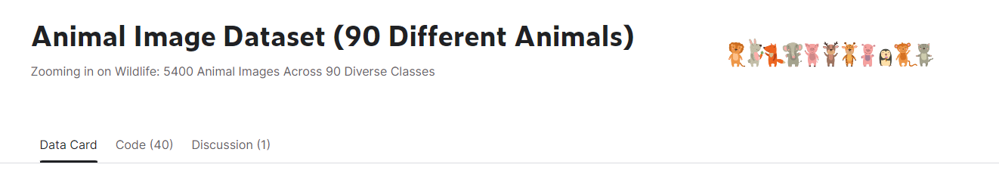
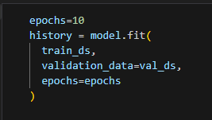
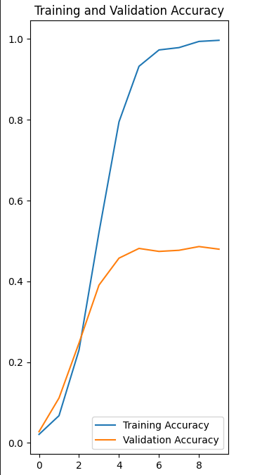
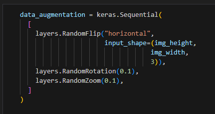
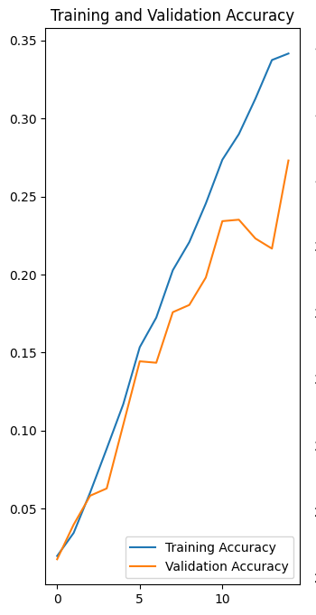
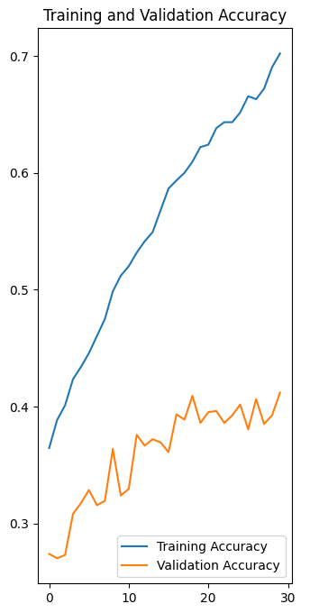
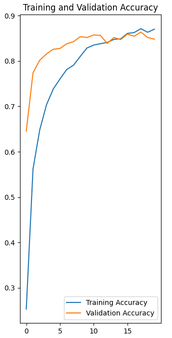
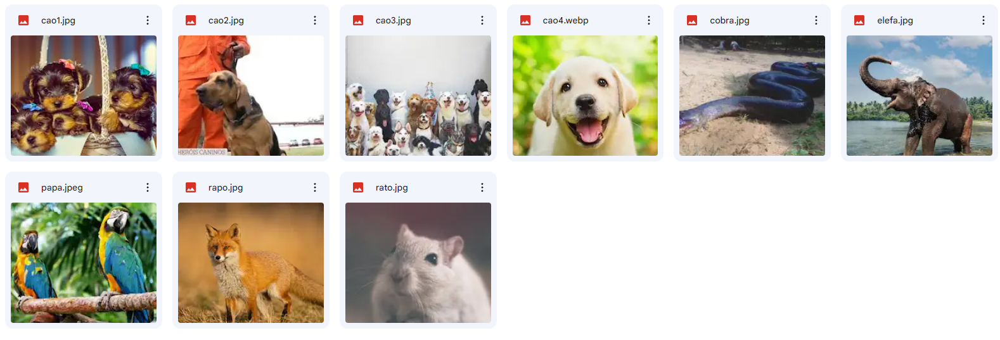

# Classificação de Imagens de Animais utilizando TensorFlow

## Paulo Henrique de França Araujo Cunha

Este projeto tem como objetivo criar um algoritmo com boas métricas para classificar animais em fotos retiradas da internet. Utilizaremos bibliotecas em Python, como TensorFlow, Matplotlib, Numpy, entre outras, para alcançar nosso objetivo.

Os principais passos para atingir o objetivo final são:

1. Encontrar um dataset
2. Preparar o dataset
3. Modelar a rede neural
4. Compilar
5. Treinar
6. Verificar resultados
7. Testar

# Introdução

As fotos são dados presentes em nossas vidas. Diariamente, gostamos de tirar fotos de animais bonitinhos, céus bonitos ou do nosso cotidiano. Pensando nisso, surgiu a ideia de explorar o reconhecimento de imagens e entender como funciona o treinamento de uma rede neural. Para isso, decidi cavar um pouco nesse problema de reconhecimento de animais em fotos.

# Ferramentas Básicas

- **Python:** Linguagem de programação utilizada no desenvolvimento do projeto.
- **TensorFlow:** Biblioteca de código aberto para aprendizado de máquina.
- **Numpy:** Biblioteca poderosa para trabalhar com processamento de dados, vetores e matrizes.
- **Matplotlib:** Biblioteca para plotar gráficos e visualizar dados.

# Metodologia

Retornaremos aos passos definidos anteriormente para alcançar o objetivo final de classificar novas imagens de animais.

###  _Utilize o código em python disponibilizado nesse mesmo repositório para melhorar seu passo a passo._

## 1. Encontrar um dataset

Escolhi o dataset do Kaggle chamado **Animal Image Dataset (90 Different Animals)**. O dataset contém 90 tipos diferentes de animais.



## 2. Preparar o dataset

A preparação do dataset envolve a declaração de variáveis e a divisão das pastas/imagens em grupos de treinamento e validação. Para normalizar o problema, todas as imagens foram redimensionadas para 180x180. O dataset foi dividido em 80% para treinamento e 20% para validação.

As 90 classes presentes no dataset são:

```python
['antelope', 'badger', 'bat', 'bear', 'bee', 'beetle', 'bison', 'boar', 'butterfly', 'cat', 'caterpillar', 'chimpanzee', 'cockroach', 'cow', 'coyote', 'crab', 'crow', 'deer', 'dog', 'dolphin', 'donkey', 'dragonfly', 'duck', 'eagle', 'elephant', 'flamingo', 'fly', 'fox', 'goat', 'goldfish', 'goose', 'gorilla', 'grasshopper', 'hamster', 'hare', 'hedgehog', 'hippopotamus', 'hornbill', 'horse', 'hummingbird', 'hyena', 'jellyfish', 'kangaroo', 'koala', 'ladybugs', 'leopard', 'lion', 'lizard', 'lobster', 'mosquito', 'moth', 'mouse', 'octopus', 'okapi', 'orangutan', 'otter', 'owl', 'ox', 'oyster', 'panda', 'parrot', 'pelecaniformes', 'penguin', 'pig', 'pigeon', 'porcupine', 'possum', 'raccoon', 'rat', 'reindeer', 'rhinoceros', 'sandpiper', 'seahorse', 'seal', 'shark', 'sheep', 'snake', 'sparrow', 'squid', 'squirrel', 'starfish', 'swan', 'tiger', 'turkey', 'turtle', 'whale', 'wolf', 'wombat', 'woodpecker', 'zebra']
```

## 3. Modelagem da rede neural

Optei por uma rede neural sequencial para este problema. O modelo é simples, composto por camadas convolucionais, de pooling, flatten e densas.

```python
model = Sequential([
  layers.Rescaling(1./255, input_shape=(img_height, img_width, 3)),
  layers.Conv2D(16, 3, padding='same', activation='relu'),
  layers.MaxPooling2D(),
  layers.Conv2D(32, 3, padding='same', activation='relu'),
  layers.MaxPooling2D(),
  layers.Conv2D(64, 3, padding='same', activation='relu'),
  layers.MaxPooling2D(),
  layers.Flatten(),
  layers.Dense(128, activation='relu'),
  layers.Dense(num_classes)
])
```

## 4. Compilar

Após a modelagem, o modelo é compilado para prepará-lo para o treinamento.

```python
model.compile(optimizer='adam',
              loss=tf.keras.losses.SparseCategoricalCrossentropy(from_logits=True),
              metrics=['accuracy'])
```

### 5. Treinar

Com o modelo compilado, o treinamento da rede neural é realizado. Neste caso, foram utilizadas 10 épocas.



### 6. Verificar Resultados

Durante a realização do projeto eu realizei 4 testes, e os resultados obtidos foram analisados para identificar possíveis melhorias no modelo.

## Primeiro Resultado



Ao analisar o primeiro resultado, vemos que a porcentagem de treinamento chegou a quase 100%, enquanto a de validação não seguiu o mesmo caminho e ficou muito abaixo, cerca de 40%. Isso indica um sinal de overfitting no nosso modelo, que é exatamente quando o modelo não consegue prever bem as imagens de teste com o que foi treinado.
Dessa forma é preciso encontrarmos maneiras de melhorá-lo.

A primeira ideia foi de usar tecnicas de aumento do dataset, ou seja, talvez por meu dataset não ter um tamanho suficientemente grande(5400 imagens), ele esteja tendo dificuldade de treinar o modelo. Dessa forma, iremos usar funções existentes no tensorflow, que a partir das imagens do próprio dataset, são criadas novas com pequenas variações.

-Girando no eixo horizontal<br>
-Girando 10%<br>
-Dando zoom de 10%<br>

E eu criei uma função que fazia todas essas aplicações de uma vez e coloquei no modelo para o segundo teste.



## Segundo Resultado



Ao rodarmos o segundo teste, era esperado que o modelo tivesse uma melhora, visto que aumentamos o nosso dataset e colocamos mais epocas pra ele treinar(15). Todavia, não foi o observado. Não entendi muito o que houve nesse caso, mas fui aplicar um terceiro teste, pensando que talvez o numero de épocas tenha sido baixo. Dessa forma, rodei o próximo teste com 30.

## Terceiro Resultado



Que resultado! 🤡

Não tivemos praticamente nenhuma melhora, o modelo conseguiu apenas melhorar sua precisão de treinamento, mas sua validação foi muito abaixo do esperado.
Minha conclusão foi de que mesmo aumentando o numero de imagens e aumentando o numero de épocas, a quantidade de imagem passadas para um treinamento do zero era muito baixa.

## Quarto Resultado

Para esse quarto teste, eu precisei utilizar uma outra abordagem, pois as anteriores estavam muito ruins e não parecia que ia melhorar. Foi então que com algumas pesquisas, descobri que poderia utilizar como base um modelo já treinado. Assim, pesquisei e encontrei um modelo que era bastante usado em problemas de classificação, e resolvi testar no meu projeto, o _MobileNetV2_ , apliquei ele na modelagem da rede neural, removi as camadas de treinamento do zero que estavam sendo usadas antes pelos testes anteriores, e mantive o aumento do dataset(com as tecnicas mencionadas no final do primeiro resultado), compilei e treinei com 20 épocas, obtive o seguinte resultado:



Finalmente um resultado ótimo! 😍

Conseguimos uma porcentagem de validação satisfatória de aproximadamente 84% e que dessa forma, poderíamos utilizar o modelo para prever novas imagens.

### 6. Testar

Por fim, com o modelo nas mãos, resta pegar novas imagens e verificar se conseguimos umas previsões corretas.

Utilizei as seguintes imagens para previsão:



E obtive os seguintes resultados:

```
1/1 [==============================] - 0s 22ms/step
Nome da Imagem:  cao4.webp
Para a imagem cao4.webp: Pertence a dog com 99.93% de confiança.


1/1 [==============================] - 0s 20ms/step
Nome da Imagem:  rato.jpg
Para a imagem rato.jpg: Pertence a hamster com 98.39% de confiança.


1/1 [==============================] - 0s 21ms/step
Nome da Imagem:  papa.jpeg
Para a imagem papa.jpeg: Pertence a parrot com 100.00% de confiança.


1/1 [==============================] - 0s 21ms/step
Nome da Imagem:  cao1.jpg
Para a imagem cao1.jpg: Pertence a bee com 53.61% de confiança.


1/1 [==============================] - 0s 24ms/step
Nome da Imagem:  cao3.jpg
Para a imagem cao3.jpg: Pertence a ox com 73.61% de confiança.


1/1 [==============================] - 0s 21ms/step
Nome da Imagem:  rapo.jpg
Para a imagem rapo.jpg: Pertence a fox com 97.55% de confiança.


1/1 [==============================] - 0s 20ms/step
Nome da Imagem:  cobra.jpg
Para a imagem cobra.jpg: Pertence a gorilla com 53.84% de confiança.


1/1 [==============================] - 0s 28ms/step
Nome da Imagem:  cao2.jpg
Para a imagem cao2.jpg: Pertence a dog com 99.66% de confiança.


1/1 [==============================] - 0s 22ms/step
Nome da Imagem:  elefa.jpg
Para a imagem elefa.jpg: Pertence a elephant com 96.38% de confiança.
```

Tive algumas anormalidades, como uma cobra ser confundida com um gorilla, ou então um cachorro ser confundido com uma abelha. Mas no geral, tivemos uma boa porcertagem de acerto, mais que 50%.

# Conclusão

Criar modelos de classificação simples como esse possuem um passo a passo tranquilo de se fazer, mas é preciso estar atento a pequenas caracteristicas importantes, quanto maior seu dataset, maior a chance de ter um bom modelo, mas é preciso perceber também as caracteristicas do seu problema, para pode escolher bem a modelagem da sua rede neural e do processo de compilação. 

Caso você queira testar, pode usar o código presente nesse repositório. Basta alterar com seus dados e informações.

Obrigado 👌 <br>

## Referências

- [TensorFlow - Classificação de Imagens](https://www.tensorflow.org/tutorials/images/classification?hl=pt-br)
- [TensorFlow - Data Augmentation](https://www.tensorflow.org/tutorials/images/data_augmentation?hl=pt-br)
- [Google Machine Learning Glossary](https://developers.google.com/machine-learning/glossary?hl=pt-br#dropout_regularization)
- [Underfitting e Overfitting](https://didatica.tech/underfitting-e-overfitting/)
- [TensorFlow - Sequential Model](https://www.tensorflow.org/guide/keras/sequential_model?hl=pt-br)
